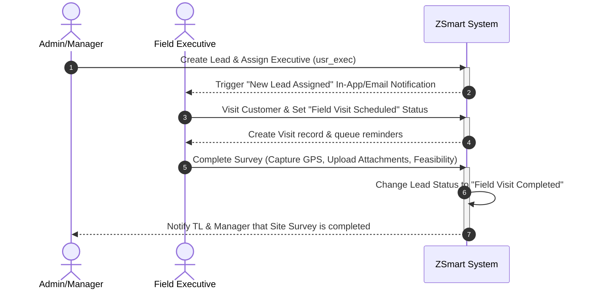
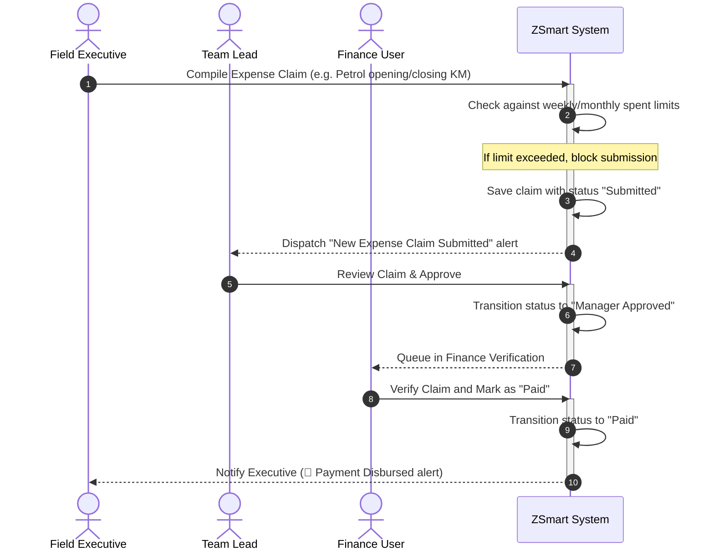
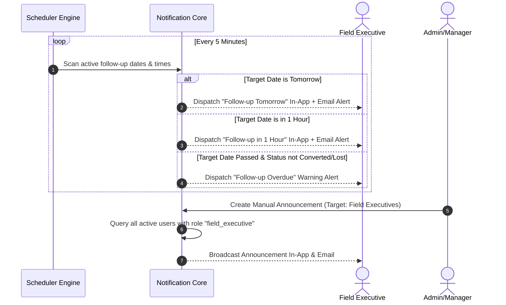

# ZSmart — Feature Documentation & Workflows

ZSmart is a modern enterprise SaaS platform designed for high-efficiency **Customer Lead Management**, **Field Operations Tracking**, **Employee Expense Claim Management**, and **Multilevel Approvals**.

---

## 👥 Role Definitions & Access Controls

ZSmart enforces strict Role-Based Access Control (RBAC) across five user variants:

| Role | Key Focus | Permissions Scope |
| :--- | :--- | :--- |
| **Admin** | System configuration, user management, and global parameter settings. | Full view, edit, create, delete privileges across all system modules. |
| **Manager** | High-level pipeline overview, secondary approval of expenses. | View all team leads/executives, secondary approval controls, targeted broadcasts. |
| **Team Lead** | Direct team coordination, primary approval of field visits and expense claims. | Manage assigned executives, verify field visit surveys, approve primary expense claims. |
| **Field Executive** | Customer visits, survey logging, and travel expense submissions. | Create leads, update assigned leads, log site surveys, and submit expense claims. |
| **Finance User** | Verify claims, confirm reimbursement compliance, and mark payments as paid. | Access verified expense queues, override claim limits, and dispatch payments. |

---

## 📦 Module-wise Feature Details

### 1. Authentication & RBAC Module
- **JWT Authorization**: Enforces stateless JWT validation. Authentication tokens are passed in authorization headers for API calls.
- **RbacGuard**: Pairs with `@RequirePermission(module, action)` decorators on NestJS endpoints. Even if a feature is hidden on the frontend, the backend blocks unauthorized requests.
- **Dynamic Menu Construction**: The backend builds a custom sidebar layout during sign-in based on user permissions, showing only allowed modules.
- **Limit Configuration**: Admins can set weekly and monthly reimbursement limits for each role via the Permissions Matrix.

### 2. Lead Management Module
- **Lead Pipeline**: Tracks leads across stages: *New, Assigned, Contacted, Field Visit Scheduled, Field Visit Completed, Quotation Shared, Negotiation, Converted, Lost*.
- **Executive Assignment**: Managers or Team Leads can assign leads to Field Executives. Assigning a lead triggers an in-app and email notification to the executive.
- **Timeline Logs**: Allows posting text remarks directly to a lead's chronological log.

### 3. Field Visits Module
- **Survey Linkage**: Field visits are linked to active customer leads.
- **HTML5 Geolocation**: Executives can capture GPS coordinates (latitude/longitude) during site surveys.
- **Multi-attachment Uploads**: Supports attaching mocked files (*Site Photo*, *Document Scan*, *Reference Document*).
- **Feasibility Metric**: Allows marking site feasibility as *Feasible*, *Challenging*, or *Not Feasible*.

### 4. Expense & Reclaim Module
- **Expense Categories**: Custom forms validate expense details based on category:
  - *Petrol*: Captures vehicle number, opening and closing KM, and pump name. Automatically calculates traveled distance and recommends standard payouts.
  - *Bus*: Logs departure/arrival cities and purpose.
  - *Miscellaneous*: Flexible fields for tolls, food, lodging, parking, and mobile recharge.
- **Role Limits Enforcement**: Automatically blocks expense submission if the claim pushes the executive's spent totals above their configured weekly or monthly reimbursement limits.
- **Rejection Overlays**: Prompts managers/team leads to input a rejection reason when declining claims, logging the feedback for the executive.

### 5. Finance Module
- **Verification Queue**: Gathers claims that have received final approval.
- **Status Progression**: Finance can approve claims as *Verified* or transition them to *Paid*, triggering instant notifications for the executive.

### 6. Notification Module
- **Multi-channel Delivery**: Supports real-time In-App alerts and simulated console Email dispatches.
- **Follow-up Scheduler**: Scans follow-up schedules every 5 minutes. Sends alerts:
  - 24 hours prior (warning).
  - 1 hour prior (upcoming alert).
  - Immediately when overdue.
- **Announcement Broadcasting**: Authorized users (Admins, Managers, Team Leads) can broadcast announcements targeting roles, teams, or all active accounts.

### 7. Reporting & Analytics Module
- **Apache ECharts Integration**: Interactive charts replace static graphs:
  - *Dashboard*: Funnel stages, category spending distributions (donut chart), and executive expenditure comparisons.
  - *Reports*: Real-time bar charts showing conversion metrics and sources.
- **Data Exporting**: Supports exporting filtered lead lists or expense spreadsheets to Excel-compatible CSVs, and generating print-optimized PDF summary reports.

---

## 🔄 Core Application Workflows

### Workflow A: Lead Generation to Technical Site Survey

### Workflow B: Expense Claim Submission to Disbursement

### Workflow C: Follow-up Reminders & Announcements

